# Waldos Farming V2

## Introduction
```
Le bot offre une variété de fonctionnalités pour améliorer l'interaction et l'engagement sur votre serveur Discord. 
Un système de boutons et de menus a été mis en place pour rendre l'utilisation du bot aussi simple que possible.
```
## Description
```
Waldos Farming V2 est un bot de divertissement qui vous permet de gérer une culture virtuelle et de gagner des $WL en cultivant et en vendant vos récoltes.
Vous pouvez acheter des graines, planter les graines dans les 4 parcelles de votre plantation, et les récolter lorsqu'elles sont prêtes. 
Vous pouvez également vendre vos plantes pour gagner de l'argent que vous pouvez dépenser dans la boutique pour acheter de nouveaux outils et de nouvelles graines.
```
## Fonctionnalités
```
- Plantation et récolte : Vous pouvez planter des graines dans les parcelles de votre plantation et les récolter lorsqu'elles sont prêtes.
- Vente de plantes : Vous pouvez vendre vos plantes au marchand pour gagner de l'argent.
- Achat d'objets : Vous pouvez acheter des graines, des outils et de l'engrai avec l'argent que vous gagnez.
- Inventaire : Consultez votre inventaire, qui comprend l'argent, les graines, les plantes et les outils.
- Classement : Un classement des 10 utilisateurs les plus riches.
```
## Commandes de jeu <permission: utilisateur>

### `/sos`

- Affiche la liste de toutes les commandes disponibles.

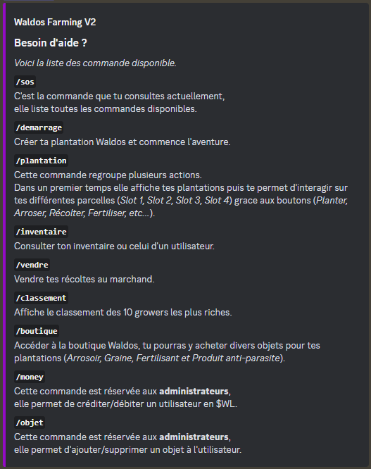

### `/classement`

- Affiche le classement des 10 utilisateurs les plus riches.

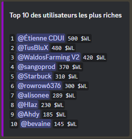

### `/demarrer`

- Crée votre plantation et vous inscrit dans la base de données.

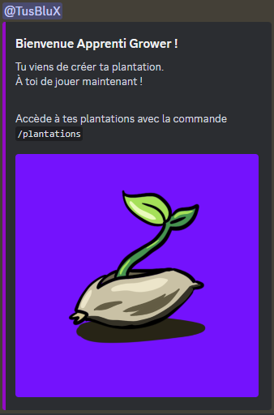

### `/plantations`

- Permet d'interagir sur les différentes parcelles (*Slot 1, Slot 2, Slot 3, Slot 4*)
  grâce aux boutons (*Planter, Arroser, Récolter, Fertiliser, Anti-parasite*).


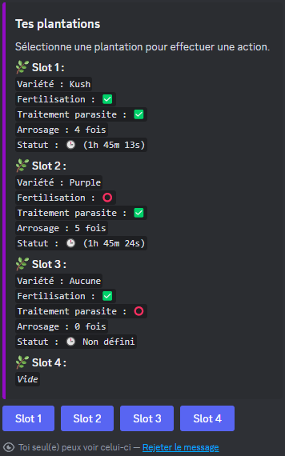

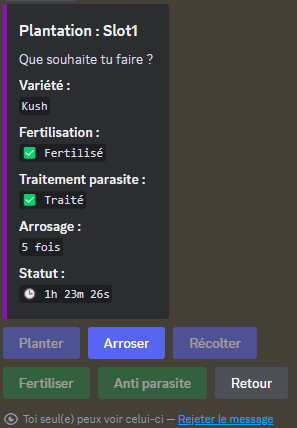
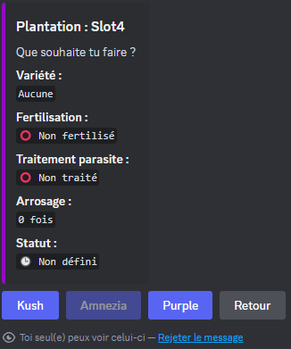


### `/inventaire` <1 option>

- Consultez votre inventaire ou celui d'un autre utilisateur.

Option : 

- `choix de l'utilisateur`

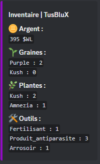

### `/vendre`

- Vendez vos plantes au marchand.

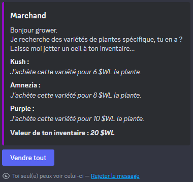

### `/boutique`

- Affiche la boutique pour y acheter divers objets (*Arrosoir, Graine, Fertilisant et Produit anti-parasite*).


## Commandes de gestion <permission: administrateur>

### `/money` <2 options>

- Permet de créditer/débiter un utilisateur.

Options : 

- `choix de l'utilisateur` 
- `choix du montant (valeur négative pour débité l'utilisateur, 50 = crédite 50 $WL | -50 = débite 50 $WL)`

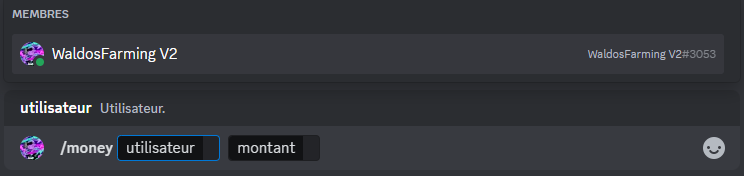

### `/objet` <5 options>

- Permet d'ajouter/supprimer un objet à un utilisateur.

Options : 

- `choix de l'utilisateur`
- `catégorie (graine, plante, outils)`
- `objet (kush, amnezia, purple, arrosoir, fertilisant, produit_antiparasite)`
- `quantité (valeur négative pour retiré l'objet de l'inventaire de l'utilisateur)` 
- `débit (si activé, l'utilisateur sera débité de la valeur de l'objet multiplié par la quantitée)`

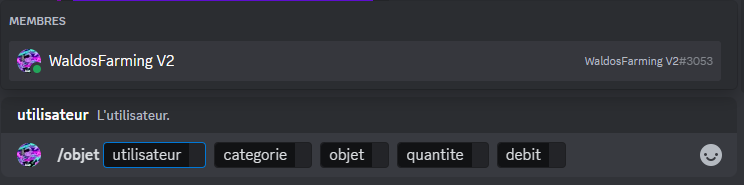

## Fonctionnement 
```
L'utilisateur possède 4 parcelles (slots) dans sa plantation.
Il peut acheter divers types de graines qui ont des niveaux de difficulté différentes.
Le niveau de difficulté se traduit par le nombre d'arrosages nécessaires.
Les variétés difficiles sont plus exigeantes et la marge d'erreur est quasi nulle, contrairement aux variétés faciles.
Un nombre d'arrosages à 0 ou supérieur à 9 tuera la plante.

Une plante peut être récoltée 2 heures après avoir été plantée.
Des attaques de parasites peuvent détruire la plante ou réduire son niveau de qualité pendant sa croissance.
Traiter sa parcelle contre les parasites évite ces attaques mais a 50% de chance de diminuer son niveau de qualité de 1.
Une parcelle non traité contre les parasites a 70% de chance de subir une attaque.
Lorsqu'une parcelle subit une attaque parasitaire la plante à 40% de chance de mourir et 60% de chance de diminuer son niveau de qualité de 1.

L'utilisateur peut fertiliser ses plantes pour augmenter leur niveau de qualité de 1.

L'arrosoir est un objet définitif, un seul arrosoir suffit pour une infinité d'arrosages.
```

```
Il existe 5 niveaux de récolte :

- Niveau 0 : L'utilisateur ne récolte pas la plante (aucun bonus).
- Niveau 1 : L'utilisateur récolte la plante (aucun bonus).
- Niveau 2 : L'utilisateur récolte la plante (bonus : 1 chance sur 2 d'obtenir 1 graine du même type).
- Niveau 3 : L'utilisateur récolte la plante (bonus : 1 chance sur 2 d'obtenir 2 graines du même type).
- Niveau 4 : L'utilisateur récolte la plante (bonus : 1 chance sur 2 de doubler la récolte ou d'obtenir une graine d'un type aléatoire parmi les variétés disponibles).
```
## Détail technique 

### Les boutons
```
Pour éviter les bugs/glitches et les utilisations mal intentionnées, certains boutons sont désactivés lorsque l'utilisateur ne remplit pas certaines conditions,
par exemple, après avoir cliqué sur le bouton "planter", de nouveaux boutons apparaissent (1 bouton pour chaque variété de graine disponible dans le jeu).
Si l'utilisateur ne possède pas un type de graine, le bouton associé sera désactivé.
Lorsqu'une parcelle est fertilisée ou si l'utilisateur ne possède pas de fertilisant, le bouton "Fertiliser" est désactivé.
Lorsqu'une parcelle est traitée contre les parasites ou si l'utilisateur ne possède pas de produit anti parasite, le bouton "Anti parasite" est désactivé.
Tant que la parcelle n'est pas prête à être récoltée, le bouton "Récolter" est désactivé.
Tant que la parcelle n'est pas libre, le bouton "Planter" est désactivé.
Lorsqu'un utilisateur récolte ou plante, le bouton "Retour" sera désactiver le temps que la sauvegarde s'effectue.
```
### Les commandes
```
Des vérifications sont effectuées à chaque fois qu'un utilisateur exécute une commande.
Ces vérifications s'assurent que l'utilisateur est enregistré dans la base de données et qu'il possède les permissions pour effectuer la commande.
Si l'utilisateur n'est pas enregistré, il ne pourra pas accéder à la boutique, au marchand, à ses plantations et à son inventaire.
```
## Structure des données
```
Les données sont stockées de manière à optimiser au maximum les interactions entre le bot et les utilisateurs.
Chaque utilisateur a sa propre sauvegarde et est identifié par son ID Discord (unique et non modifiable).
Les objets du jeu sont stockés dans un fichier "database" qui contient toutes les informations nécessaires au bon fonctionnement du bot.
```
### Utilisateurs
Chaque utilisateur est représenté par un objet JSON qui contient les propriétés suivantes :

- `id` : ID Discord de l'utilisateur.
- `nomServeur` : Nom global de l'utilisateur.
- `nom` : Nom d'utilisateur Discord.
- `inventaire` : Inventaire de l'utilisateur.
- `plantations` : Plantations de l'utilisateur.

L'objet `inventaire` contient les propriétés suivantes :

- `money` : La quantité d'argent que l'utilisateur possède.
- `graines` : Les graines que l'utilisateur possède.
- `plantes` : Les plantes que l'utilisateur possède.
- `outils` : Les outils que l'utilisateur possède.

L'objet `plantations` contient les propriétés suivantes :

- `slot1` : les informations concernant la parcelle 1.
- `slot2` : les informations concernant la parcelle 2.
- `slot3` : les informations concernant la parcelle 3.
- `slot4` : les informations concernant la parcelle 4.

### Objets
Les objets du jeu sont représentés par un objet JSON qui stocke les informations propres à chaque objet, tels que les graines, les plantes, les outils et leurs prix, valeur de revente, descriptions et exigences.

- `graine` : Les objets de type '*graine*' ont les propriétés suivantes : prix, description et exigence (*0 = facile, 1 = normal, 2 = difficile*).
- `plante` : Les objets de type '*plante*' ont les propriétés suivantes : valeur de revente, description.
- `outils` : Les objets de type '*outils*' ont les propriétés suivantes : prix, description.

## Fichier de configuration
Certains paramètres ont été stocké dans un fichier de configuration "config.json" afin de faciliter certaines modifications.

Ce fichier contient :

- `botId` : L'ID Discord du bot.
- `botColor` : Le code couleur des messages stylisé par le bot.
- `devise` : La devise de l'argent du jeu.
- `farmingChannel` : L'ID du salon dans lequel les messages public sont envoyée.
- `dureePousse` : La durée de croissance des plantes (en heure).
- `startMoney` : Le montant d'argent avec lequel l'utilisateur commence.

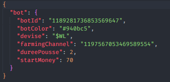

## Contribution
Si vous souhaitez contribuer à ce projet, veuillez contacter Thierry Breure (Tusblux) à cette adresse mail : `thierrybreure.contactpro@gmail.com` ou via [thierrybreure.fr](https://www.thierrybreure.fr/)

## Licence
Ce projet n'est pas sous licence actuellement.
